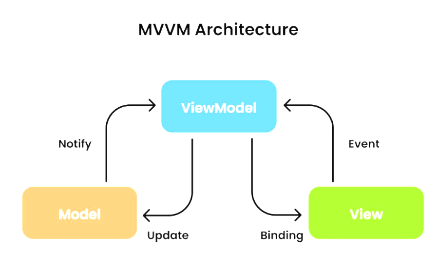

## MVVM 패턴이란?
**MVVM (Model-View-ViewModel) 패턴** 은 ```Model```, ```View```, ```ViewModel```의 약자로 프로그램의 비지니스 로직과, 프레젠테이션 로직을 UI로 명확하게 분리하는 패턴이다.

## Model
데이터를 다루는 부분. 비즈니스 로직을 포함함
+ 데이터와 비즈니스 로직을 담당하는 부분이다.
+ 데이터를 가져오고 저장하는 역할을 수행한다.
+ 보통 데이터베이스, 네트워크 요청 또는 파일 시스템과 같은 데이터 소스와 상호 작용한다.

## View
레이아웃과 화면을 보여주는 역할임

+ 사용자 인터페이스를 담당하는 부분이다.
+ 사용자가 보는 화면을 표시하고, 사용자 입력을 처리한다.
+ 보통 XAML과 같은 마크업 언어를 사용하여 디자인된다.

## ViewModel
View와 Model 사이에서 중재자 역할을 수행합니다.
+ View에서 발생하는 이벤트를 감지하고, 해당 이벤트에 맞는 비즈니스 로직을 수행.
+ Model과 상호작용하여 데이터를 가져오거나 업데이트하고, View에 데이터를 업데이트하는 역할을 수행.
+ View에 표시할 데이터를 가공하여 제공하는 역할을 수행.

## MVVM 동작 과정

```
1. 사용자의 Action들은 View를 통해 들어온다.
2. View에 Action이 들어오면 ViewModel에 Action을 전달한다.
3. ViewModel은 Model에게 데이터를 요청한다.
4. Model은 ViewModel에게 요청받은 데이터를 응답한다.
5. ViewModel은 응답 받은 데이터를 가공하여 저장한다.
6. View는 Data Binding을 이용해 UI를 갱신시킨다. 
```

## MVVM의 장단점
### 장점
+ 뷰 로직과 비지니스 로직을 분리하여 생산성을 높힐 수 있다. (UI가 나오지 않아도 개발 가능)
+ 테스트가 수월해진다. (의존성이 없기 때문)
+ 뷰와 뷰모델이 1:n 관계이기 때문에 중복되는 로직을 모듈화 해서 여러 뷰에 적용할 수 있다. (코드 재사용 가능)
+ 많은 기업들이 애용하는 디자인 패턴이다.

### 단점
+ 설계하기가 복잡하다. (Rx,데이터 바인딩에 대한 지식 필요)
+ 뷰모델이 비대해질 수 있다.
+ 데이터 바인딩으로 인한 메모리 소모가 심하다.
+ ViewModel 설계가 복잡하다는 단점이 있다.