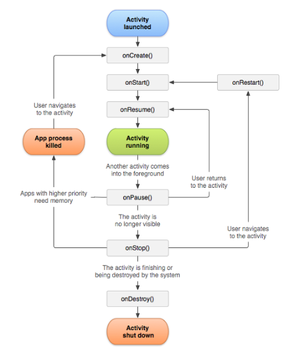

## Lifecycle
Lifecycle은 Life + cycle의 합성어로, 삶의 순환이라고 직역할 수 있다.\
말 그대로 탄생하고 성장하여 죽음에 이르기까지의 과정이라고 생각한다면, 이것을 안드로이드 앱에 적용한 것이 바로 Android Lifecycle

## Activity Lifecycle

+ 위 사진은 안드로이드 4대 컴포넌트 중 하나인 Activity의 Lifecycle 순서도이다.

## 핵심 콜벡 매소드
+ onCreate()
+ onStart()
+ onResume()
+ onPause()
+ onStop()
+ onDestroy()
## onCreate()
+ Activity가 생성되면 가장 먼저 호출됨
+ 화면 Layout 정의, View 생성, Databinding 등은 이곳에 구현함
생명주기 통틀어서 단 한 번만 수행되는 메소드
+ 따라서 Activity 최초 실행에 해야하는 작업을 수행하기에 적합함
## onStart()
+ Activity가 화면에 표시되기 직전에 호출됨
화면에 진입할 때마다 실행되어야 하는 작업을 이곳에 구현함
##  onResume()
+ Activity가 화면에 보여지는 직후에 호출됨
현재 Activity가 사용자에게 포커스인 되어있는 상태
##  onPause()
+ Activity가 화면에 보여지지 않은 직후에 호출됨
+ 현재 Activity가 사용자에게 포커스아웃 되어있는 상태
다른 Activity가 호출되기 전에 실행되기 때문에 무거운 작업을 수행하지 않도록 주의해야함
+ 영구적인 Data는 이곳에 저장한다.
##  onStop()
+ Activity가 다른 Activity에 의해 100% 가려질 때 호출되는 메소드
홈 키를 누르는 경우, 다른 액티비티로의 이동이 있는 경우가 있음
+ 이 상태에서 Activity가 호출되면, onRestart() 메소드가 호출됨
## onDestroy()
+ Activity가 완전히 종료되었을 때 호출되는 메소드
+ 사용자: finish(), onBackPressed()(기존 액티비티의 onResume()까지 호출된 후 onDestroy() 호출)
+ 시스템: 메모리부족(프로세스 종료)
+ onStop(), onDestroy() 메소드는 메모리 부족이 발생하면 스킵될 수 있음

## onRestart()
+ onStop()이 호출된 이후에 다시 기존 Activity로 돌아오는 경우에 호출되는 메소드
+ onRestart()가 호출된 이후 이어서 onStart()가 호출된다.