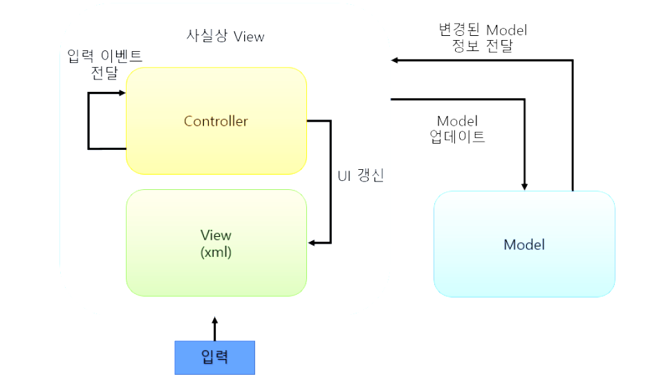

## MVC
MVC는 ```Model```, ```View```, ```Controller``` 의 약자이다.


구조를 표현한 사진이다.\
+ 그림을 보면 View와 Model은 서로 분리되어 있는 것을 볼 수 있다.
+  또한 Model은 종속되는 곳이 없기 때문에 테스트하기 쉽고 재사용하기 용이하다. 
+ 그러나 Controller 입장에서는 Model에 대한 의존성이 생기고 View와 매우 강하게 결합된다. 
+ 그래서 레거시 코드에서 자주 볼 수 있듯이 Controller에 많은 코드가 쌓이게 될 가능성이 높다.

## MVC의 장점
+ Model과 View의 분리됨.
+ Model의 비종속성으로 재사용 가능함.
+ 구현하기 가장 쉽고 단순함.
+ 유닛테스트에서 View는 테스트 할 부분이 없기 때문에 쉽게 Model만 테스트 가능.
+ 개발기간이 짧아짐. (안드로이드에서의 장점)
## MVC의 단점
+ Model과 View사이에 의존성 발생함. (서로간의 의존성 완전히 없앨 수 없음)
+ 즉, View의 UI 갱신을 위해 Model을 직/간접적으로 참조하므로 앱 자체가 커지고 로직이 복잡해질수록 유지보수가 힘들어짐.
스파게티 코드가 될 가능성이 높음.
+ 코드 복사/붙여넣기가 많아지게 되면서 코드 분리조차 되지않으면 코드가 아주 제대로 꼬여버립니다. 그렇기에 복잡도는 증가한다. 다만, 이는 설계 단계에서 제대로해서 분리를 잘하면 어느정도 해소 된다.
+ 시간이 지날수록 컨트롤러에 많은 코드가 쌓여 코드가 비대화하여 문제 발생 가능
+ Controller가 안드로이드 API에 깊게 종속되므로 유닛 테스트가 어려움.
