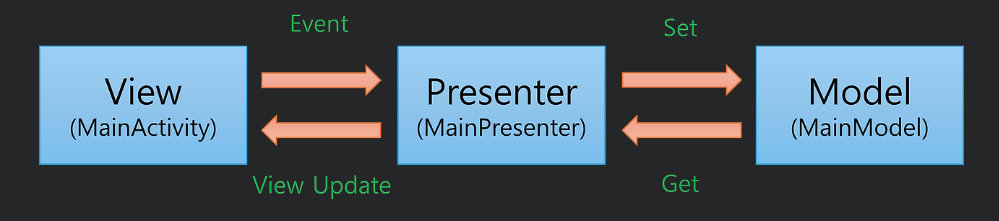

## MVP
MVP는 Model View Presenter의 약자로 MVC패턴을 패턴을 기반으로 하는 아키텍쳐
+ 요약: MVC패턴에서 View와 Model의 의존성을 없애고 단위 테스트가 어려웠던 문제점을 해결하기 위해 등장하게된 패턴

### Model
앱에 사용되는 데이터를 관리 담당하는 역할을 합니다. 흔히 '비즈니스 로직'이리고 부르는 부분이다. 모델에는 network API, 데이터 캐싱, 데이터베이스 등이 포함되고 Repository pattern을 사용하는 경우 Repository도 포함된다.

### View
사용자 인터페이스 영역이며, Activity, Fragment 등이 포함되고 데이터를 표시하는 역할만 합니다. 오직 Presenter를 통해서 데이터를 요청하고 전달 받기때문에 Presenter에 의존적이다.

### Presenter
View와 Model 사이 중개자 역할을 담당합니다. View에서 사용자 이벤트를 전달 받아 Model에 데이터를 요청하고 전달받은 데이터를 View에 그대로 전달 합니다. ( MVVM의 ViewModel과 비교했을때 ViewModel은 View를 알지 못하고 View에 대한 참조를 가지고 있지 않다. 하지만 Presenter는 View와 Model 모두 참조 하고있다)

이 사진을 보면 Model-View-Presenter의 각각 어떤 역할을 하는지 더 잘 알게 된다.

## MVP의 장점
+ Model 과 View 간의 결합도를 낮추면, 새로운 기능 추가 및 변경을 해야 할 때 관련된 해당 부분만 코드 수정하면 되기 때문에 확장성이 좋아짐
+ 유닛테스트시 테스트 코드를 작성하기 편리해지기 때문에 더 쉽게 안전한 코딩이 가능
+ UI와 Data 각각 파트를 나누기때문에 할 일이 명확해지고 그 결과로 쉽게 빠른 코딩이 가능

## MVP의 단점
+ 앱이 복잡해질수록 View와 Presenter 사이의 의존성이 강해짐
+ MVC의 패턴처럼 Presenter도 어느 정도의 시간이 지남에 따라 추가 비즈니스 로직이 집중(비대해짐)
+ 이로인해 Presenter가 거대해진다면 동시에 문제를 다루기도 어렵고, 발생하기도 쉬우며, 서로간의 분리또한 까다로워 짐