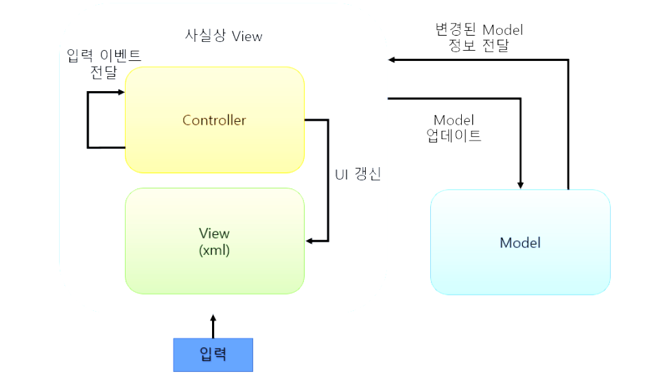

## MVC
MVC는 ```Model```, ```View```, ```Controller``` 의 약자이다.


구조를 표현한 사진이다.\
+ 그림을 보면 View와 Model은 서로 분리되어 있는 것을 볼 수 있다.
+  또한 Model은 종속되는 곳이 없기 때문에 테스트하기 쉽고 재사용하기 용이하다. 
+ 그러나 Controller 입장에서는 Model에 대한 의존성이 생기고 View와 매우 강하게 결합된다. 
+ 그래서 레거시 코드에서 자주 볼 수 있듯이 Controller에 많은 코드가 쌓이게 될 가능성이 높다.