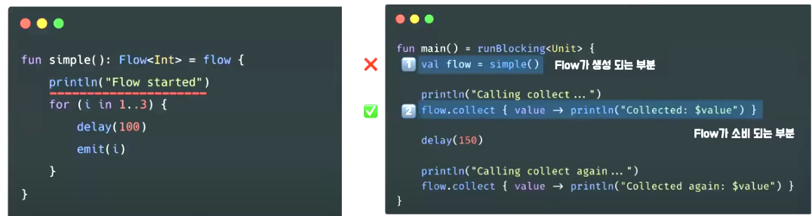
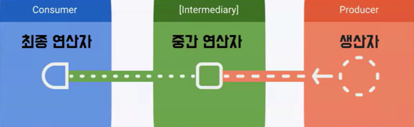

## Flow
Flow는 비동기적으로 동작하는 **데이터 스트림**으로, 순차적으로 값을 방출하고 정상적으로 완료하거나 예외와 함께 종료된다.

## 데이터 스트림
데이터 스트림(Data Stream)이란 데이터의 **순차적인 흐름**을 의미한다.\
예시: Sequence

+ **Producer** : 데이터 스트림의 값을 **방출**하는 생산자
+ **Intermediary** : Stream에 내보내는 값이나, Stream 자체를 **수정, 값 필터링** 등이 가능한 중개자
+ **Consumer** : 데이터 스트림의 값을 **소비**하는 소비자

하나의 데이터를 발행하는 발행자가 있고 해당 발행자는 소비자에게 지속적으로 데이터를 전달하는 역할을 한다.

**Hot Stream🔥:** 데이터를 소비하는 것과 **무관하게** 작업 수행 소비자가 구독하기 전에 이미 데이터 생산 시작 데이터 요청 시 최신 데이터 수신\
**예시:** Collection(List.Set) / Channel / StateFlow / SharedFlow\
**Cold Stream🥶:** 데이터 **요청이 있을 때만** 작업 수행 소비자가 구독할 때 데이터 생산 시작 각각 독립적인 데이터 제공\
**예시:** Sequence / RxJava / **Flow**


Flow는 Flow가 생성되는 부분이 아니라 Flow가 소비되는 부분에서 출력\
소비자가 **collect**로 데이터를 수집하기 전까지는 데이터를 생산하지 않는다.

## 비동기 (Asynchronus)
코루틴과 결합하여 비동기적으로 데이터 흐름을 유연하게 관리 가능
### 👌비동기 데이터 흐름을 나타내는 객체
+ Flow를 반환하는 함수에는 비동기 작업을 수행하고 있음에도 **suspend**가 붙지 않는다
+ Flow가 수집되기 전까지는 어떠한 비동기 작업도 **수행되지 않는다**
+ 데이터를 어떻게 생산할지 **정의**하는 역할
### 👌구조적 동시성 (Structured Concurrency) 지원
+ collect는 **suspend 함수**로 구현되어 있기 때문에 **코루틴**내에서 호출 되어야 한다.
+ collect 함수 호출 시 Flow 내부에 있는 비동기 작업이 실행 된다.
+ Flow는 **호출된 스코프 내**에서 실행. 관리 된다.
+ Flow가 실행되는 코루틴이 취소될 때 Flow에 의해 실행된 모든 자원들이 자동으로 정리된다.

## Flow의 구조



**최종 연산자**: 값을 소비하는 유일한 방법, Flow의 데이터를 최종적으로 소비하는 중요한 역할\
**중간 연산자**: Flow의 데이터 스트림을 여러 단계에 걸쳐 조작할 수 있는 API 제공
+ suspend 함수 호출 가능
+ 다양한 연산자들과 결합해 복잡한 데이터를 간결하고 효율적으로 처리

**생산자** : 앞에서 봤던 Flowbuilder가 속해있다. 안드로이드 내에서는 해당라이브러리에서 flow반환형을 지원하고 있어서 실질적으로 Flowbuilder를 사용하는 일은 적음

```kotlin
flow { emit("Hello")} // 생산자
    .onEach { println(it)} // 중간 연산자
    .onStart { println("Do something before")} 
    // 중간 연산자
    .onCompletion { println("Do something after")} 
    // 중간 연산자
    .catch { emit("Error")} // 중간 연산자
    .collect{ println("Collected : $it")} // 최종 연산자
```

## LiveData와 Flow?
반응형 프로그래밍(Reactive Programming)\
데이터의 변화에 따라 자동으로 이벤트를 발생시키고 이를 소비자에게 **지속적으로 전달**하는 프로그래밍

데이터를 발생시키는 **발행자**가 있고 소비자는 발행자를 **구독**하는 형태로 구성 새로운 데이터가 들어오면 데이터를 소비자에게 지속적으로 발행

Data. Domain Layer에서의 LiveData 사용을 지양, UI Layer가 아닌 다른 계층에서 데이터 스트림을 사용해야 한다면 **Flow**를 사용
+ viewModel에서 LiveData로 변환하여 UI에서 쉽게 사용 가능하다 -asLiveData()